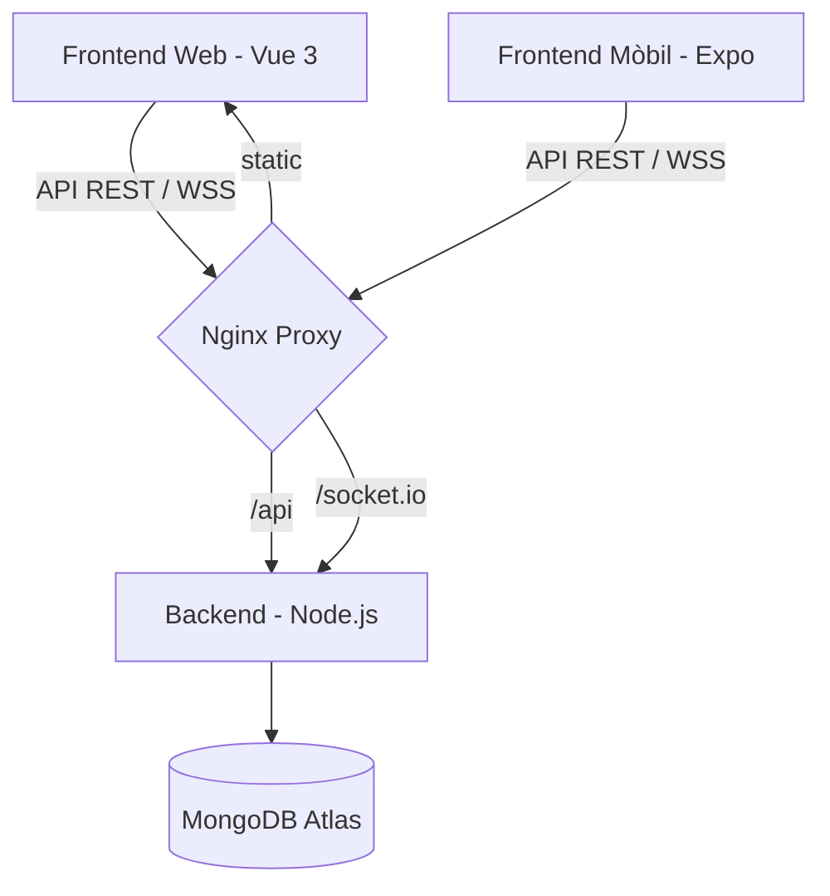

# 05_SYSTEM_MAP: Mapa de Serveis i Topologia de Fitxers

## 1. Topologia de Serveis
Astro es desplega com un ecosistema de serveis connectats:

## 2. Mapa del Repositori
### 📂 Root
- `README.md`: Presentació general del projecte i equip.
- `LICENSE`: Apache 2.0.
- `/doc`: Documentació tècnica i d'especificació.

### 📂 /doc
- `/openspec`: Especificacions funcionals i tècniques (Requisits, Scenarios, Tests).
- `/context`: Guies de context per a desenvolupadors i agents d'IA (Objective, Architecture, etc.).

### 📂 /Astro_project
- `docker-compose.yml`: Configuració per a l'orquestració de contenidors.
- `/backend`: Lògica de servidor, models de dades i rutes.
- `/frontend/web`: Aplicació Vue 3 per a navegadors.
- `/frontend/mobile`: Aplicació React Native per a dispositius mòbils.

## 3. Endpoints Principals (Resum)
| Ruta | Mètode | Descripció |
| :--- | :--- | :--- |
| `/api/auth/login` | POST | Autenticació de l'usuari. |
| `/api/game/record` | POST | Guardar puntuació de partida i calcular XP. |
| `/api/user/profile` | GET | Obtenir dades del pilot i rang. |
| `/api/shop/buy` | POST | Adquisició d'ítems de la botiga. |
| `/api/social/friends`| GET | Llistat d'amics i estat online. |

## 4. Orquestració de Dades
- **Persistència:** MongoDB gestiona la jerarquia d'usuaris, les seves possessions (inventari) i els títols desbloquejats.
- **Volatilitat:** Socket.io gestiona l'estat momentani de la connexió per permetre notificacions instantànies de desafiaments.
